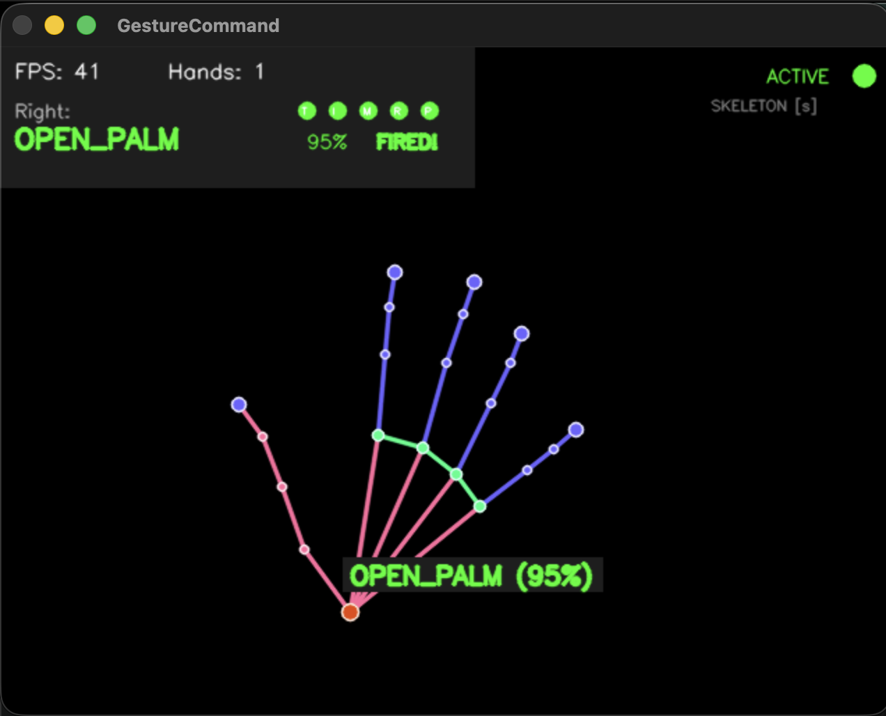
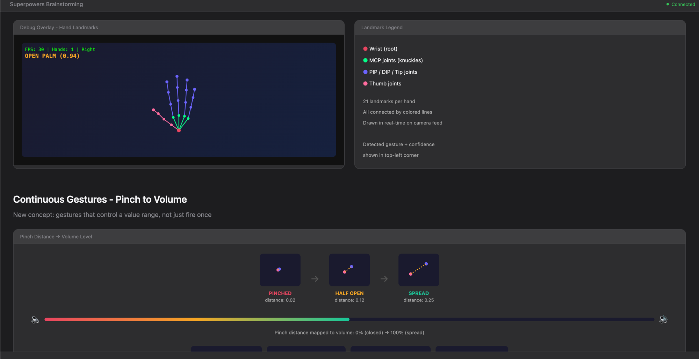

<div align="center">

# `Skaleton_Comand`

### Control your Mac with hand gestures

[](https://python.org)
[](https://apple.com)
[](LICENSE)
[](https://ai.google.dev/edge/mediapipe/solutions/vision/hand_landmarker)

> **Map hand gestures to keypresses, mouse control, shell commands, and macros — all through your webcam.**

<br>



<br>

*Real-time hand skeleton with gesture detection, finger state indicators, and confidence tracking*

</div>

---

## Quick Start

### Install

```bash
# Clone
git clone https://github.com/L-ubu/Skaleton_Comand.git
cd Skaleton_Comand

# Create virtual environment
python3 -m venv .venv
source .venv/bin/activate

# Install
pip install -e .
```

### Run

```bash
# Start with debug overlay (recommended for first run)
gesture-command start

# Start with only specific gestures enabled
gesture-command start --gestures open_palm,fist

# Start in mouse mode (control cursor with your hand)
gesture-command start --mouse

# Run without the debug window
gesture-command start --no-debug
```

### Keyboard Shortcuts

| Key | Action |
|-----|--------|
| `ESC` | Toggle pause |
| `s` | Toggle skeleton-only view |
| `m` | Toggle mouse mode |
| `q` | Quit |
| `Cmd+Shift+G` | Global toggle (works without focus) |

---

## What It Does

Your webcam tracks your hand using **MediaPipe's 21-landmark model**. Each frame, the system recognizes what gesture you're making and fires the mapped action — a keypress, mouse click, shell command, or multi-step macro.

<div align="center">


*Landmark tracking with color-coded joints and continuous gesture mapping*
</div>

### Discrete Gestures — *fire once when held*

Gestures go through a **dwell + cooldown** filter to prevent accidental triggers. Hold the gesture for the dwell time, it fires once, then enters cooldown before it can fire again.

| Gesture | Default Action | Description |
|---------|---------------|-------------|
| `open_palm` | Screenshot (`Cmd+Shift+3`) | All 5 fingers extended |
| `fist` | Close window (`Cmd+W`) | All fingers curled |
| `thumbs_up` | Select all + copy | Only thumb up, others curled |
| `peace` | App switch (`Cmd+Tab`) | Index + middle extended |
| `point` | Mouse click | Only index extended |
| `rock` | Play/pause (`Space`) | Index + pinky extended |
| `pinch` | — | Thumb touching index tip |
| `three_fingers` | — | Index + middle + ring extended |

### Continuous Gestures — *control a value range in real-time*

These don't fire once — they output a **0.0 to 1.0 value** every frame that drives things like volume and brightness. Includes smoothing, dead zones, and an **activation delay** so they don't trigger accidentally.

| Channel | What it measures | Default action |
|---------|-----------------|---------------|
| `pinch_distance` (left hand) | Thumb-to-index distance | **Screen brightness** |
| `pinch_distance` (right hand) | Thumb-to-index distance | **System volume** |
| `hand_rotation` | Palm roll angle | — |
| `palm_height` | Vertical hand position | — |
| `hand_spread` | Average fingertip distance | — |
| `fist_squeeze` | Average finger curl | — |

> **How pinch activation works:** Hold a pinch posture (middle/ring/pinky curled) for 800ms to activate. Then spread or close your thumb and index to control the value. Open your hand to deactivate.

### Mouse Mode

Turn your hand into a mouse. Point to move, tap to click.

| Input | Action |
|-------|--------|
| Index finger position | Cursor movement (X from tip, Y from knuckle for stability) |
| Index finger tap down | Left click |
| Middle finger tap down | Right click |
| Peace sign + hand up/down | Scroll |

---

## Configuration

Everything is configured through a JSON file at `~/.config/gesture-command/config.json`. A default is created on first run.

```bash
# Show current config
gesture-command config

# Open in your editor
gesture-command config --edit

# Validate config
gesture-command config --validate
```

### Example Config

```json
{
  "settings": {
    "camera_index": 0,
    "confidence_threshold": 0.7,
    "default_dwell_ms": 300,
    "default_cooldown_ms": 500,
    "toggle_hotkey": "cmd+shift+g",
    "show_debug": true
  },
  "gestures": {
    "open_palm": {
      "action": { "type": "keypress", "keys": "cmd+shift+3" },
      "dwell_ms": 400,
      "cooldown_ms": 2000
    },
    "fist": {
      "action": { "type": "shell", "command": "open -a 'Finder'" }
    },
    "thumbs_up": {
      "action": {
        "type": "macro",
        "steps": [
          { "type": "keypress", "keys": "cmd+a" },
          { "delay_ms": 100 },
          { "type": "keypress", "keys": "cmd+c" }
        ]
      }
    }
  },
  "continuous": {
    "pinch_distance:left": {
      "action": { "type": "brightness" },
      "activation_ms": 800,
      "smoothing": 0.3
    },
    "pinch_distance:right": {
      "action": { "type": "volume" },
      "activation_ms": 800
    }
  }
}
```

### Action Types

| Type | Description | Example |
|------|-------------|---------|
| `keypress` | Simulate key combo | `{"type": "keypress", "keys": "cmd+c"}` |
| `mouse_click` | Click mouse button | `{"type": "mouse_click", "button": "left"}` |
| `shell` | Run shell command | `{"type": "shell", "command": "open -a Safari"}` |
| `macro` | Multi-step sequence | Array of actions with optional delays |
| `brightness` | Screen brightness (continuous) | Maps pinch distance to brightness |
| `volume` | System volume (continuous) | Maps pinch distance to volume |
| `scroll` | Scroll control (continuous) | Center = stop, edges = scroll |
| `zoom` | Cmd+/- zoom (continuous) | Value changes trigger zoom in/out |
| `applescript` | Run AppleScript (continuous) | `{"type": "applescript", "script": "..."}` |

Config changes are **hot-reloaded** — edit the file while the engine is running and it picks up changes automatically.

---

## How It Works

```
Webcam  -->  MediaPipe Hand Landmarker (21 landmarks, VIDEO mode)
                    |
                    v
        +----- Hand Data -----+
        |                     |
   Discrete               Continuous
   Recognizer             Recognizer
        |                     |
   8 gesture              5 channels
   detectors              (smoothed)
        |                     |
   Dwell/Cooldown         Activation
   Filter Pipeline        Delay
        |                     |
   Fire Action            Drive Action
   (keypress,             (brightness,
    shell, macro)          volume, scroll)
```

- **Threaded camera** — capture runs on a background thread so the main loop never blocks on I/O
- **Frame skipping** — detection runs every 2nd frame, rendering every frame = ~45 FPS with 2 hands
- **Synchronous tracking** — VIDEO mode keeps the skeleton perfectly in sync with the camera feed (no lag)
- **Per-hand routing** — left and right hand can drive different continuous actions

---

## Future Plans

- [ ] **YouTube / YouTube Music integration** — gesture controls for media playback (play/pause, skip, volume) mapped to media keys
- [ ] **Per-app profiles** — different gesture mappings per active application
- [ ] **Dynamic gestures** — detect motion patterns like swipes, circles, waves
- [ ] **Face & body tracking** — add MediaPipe face/pose for head nods, shoulder shrugs, eye blinks
- [ ] **Gesture combos** — two-hand gestures, e.g. left fist + right peace = custom action
- [ ] **GUI config editor** — visual configuration instead of editing JSON
- [ ] **Gesture recording** — record and replay custom gesture definitions

---

## Requirements

- **macOS** (uses Quartz for brightness, osascript for volume)
- **Python 3.11+**
- **Webcam**
- **Accessibility permissions** for pynput (System Settings > Privacy & Security > Accessibility)

---

## License

[MIT](LICENSE) — do whatever you want with it.
